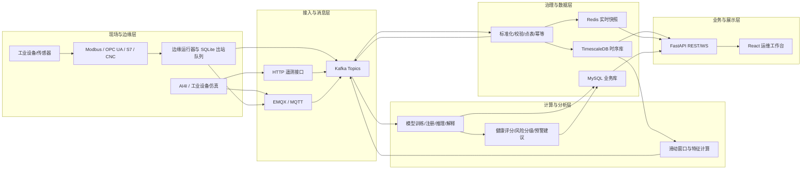
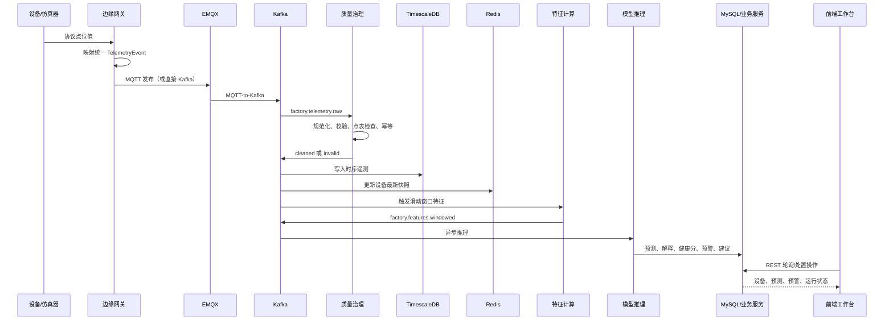
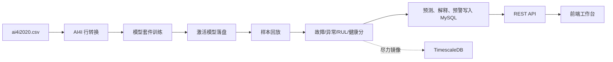

# 工业物联网大数据设备故障预测与健康评估系统

## 项目现状与功能审计报告

> **报告用途**：项目阶段汇报、领导审阅、毕业设计答辩、后续建设排期  
> **审计日期**：2026 年 7 月 14 日  
> **审计口径**：以当前仓库源代码、运行入口和部署配置为准。历史文档仅作参考；当文档与代码冲突时，以当前代码为准。

---

## 1. 执行摘要

### 1.1 项目定位

本项目是一套面向工业设备预测性维护（Predictive Maintenance，PdM）的全栈系统，目标是把工业现场的设备遥测数据转化为可解释、可处置的设备健康结论。系统覆盖以下业务闭环：

1. 工业设备和传感器数据接入；
2. 遥测数据清洗、校验、标准化与幂等处理；
3. 时序数据存储、实时状态快照和滑动窗口特征计算；
4. 故障概率、异常程度、健康分数和剩余寿命预测；
5. 风险分级、预警生成和维护建议；
6. 设备、预测、预警、模型和运行链路的可视化管理。

### 1.2 当前完成度结论

当前项目已经形成了**可演示、可联调、具备完整架构骨架的预测性维护系统**，并非只有页面原型：后端存在真实 API、数据库设计、Kafka 消息链路、模型训练和推理逻辑；前端工作台会请求真实后端接口，接口失败时展示空态，不会把假数据包装为线上数据。

但项目当前仍应定义为**演示版**，还不能直接定义为生产投运系统。主要原因是：

- 已实现完整实时链路代码，但本地默认配置关闭流式消费者；Compose 部署才显式打开这些开关。
- 已支持 Modbus、OPC UA、S7 读取适配，但未完成具体工厂设备与 CNC 厂商 SDK 的现场接入认证。
- 已有模型训练、注册、推理和解释能力，但实时推理依赖事先生成激活模型。
- 已有基础鉴权框架，但默认关闭，账号和密钥仍为演示配置。
- 已有运行诊断接口，但监控、告警、备份恢复、消息持久化和持续集成尚未形成生产闭环。
- 后端测试覆盖较广，但主要是单元测试和契约测试，缺少真实 Kafka、EMQX、TimescaleDB 和物理设备的端到端验收。

### 1.3 面向领导的准确汇报口径

建议表述：

> 项目已完成从工业数据接入、质量治理、时序存储、特征计算、模型训练与推理到预测预警和可视化处置的全链路设计与核心实现；当前可以通过 AI4I 数据集和工业设备仿真稳定展示业务闭环。下一阶段重点不是继续堆叠页面，而是完成真实设备协议联调、生产安全加固、可观测与备份体系、真实中间件端到端验收，使系统由工程验证版升级为可试点部署版本。

不建议表述：

- “系统已经在真实工厂稳定运行”；当前没有现场运行证据。
- “已经完成 Spark 大数据计算集群”；当前只有 Spark 配置，没有 Spark 服务和作业。
- “已完成深度学习在线推理”；`torch` 被列入开发依赖，但当前主生产推理链使用 LightGBM、Isolation Forest、scikit-learn 和 SHAP。
- “系统已经具备生产级安全和灾备”；当前仍为演示级账号、密钥和运维配置。

---

## 2. 总体架构

### 2.1 模块关系

### 2.2 关键职责边界

| 层次 | 负责什么 | 不负责什么 |
|---|---|---|
| 接入层 | 接收设备原始数据并转换为统一遥测事件 | 不直接做故障判断 |
| 治理层 | 数据校验、规范化、点位匹配、幂等和窗口化 | 不生成维护建议 |
| 计算层 | 生成统计特征和特征窗口 | 不直接操作页面 |
| 模型层 | 输出故障概率、异常结果、健康分数、RUL、解释项 | 不决定预警处置流程 |
| 业务层 | 风险分级、预警、维护建议和状态流转 | 不重新清洗原始数据 |
| 展示层 | 调用 API 呈现状态并执行用户操作 | 不在浏览器里训练模型或伪造监控数据 |

这种边界是合理的：原始数据、特征、模型结果和业务结论分别归属不同模块，可降低复杂度扩散和数据流回溯风险。

---

## 3. 两条实际业务链路

### 3.1 实时工业遥测链路

**实时链路成立的前置条件**：

1. MySQL、Redis、TimescaleDB、Kafka、EMQX 正常运行；
2. MQTT-to-Kafka、raw、cleaned、feature、inference 五类消费者已开启；
3. 设备和测点已注册，否则原始事件会进入 invalid 主题；
4. 已通过 AI4I 导入或其他训练流程生成激活模型；
5. 特征点位名称与模型输入能够正确对齐。

本地 `backend/app/core/config.py` 默认关闭五类流处理开关；`backend/.env.example` 和 `docker-compose.yml` 会显式开启。也就是说，**代码具备链路不等于任意启动方式都会自动运行链路**。

### 3.2 AI4I 数据集训练与演示链路

该链路不依赖真实工业设备，是当前最稳定的演示路径。它可以证明模型训练、模型注册、推理结果、健康评分和预警展示的业务闭环，但不能代替真实设备接入与实时中间件压力验证。

---

## 4. 根目录逐项说明

| 文件/目录 | 作用 | 当前状态 |
|---|---|---|
| `README.md` | 本地依赖、基础设施、后端、前端、边缘运行器和仿真器启动说明；同时声明模块职责边界 | 有效，但应继续随部署变化更新 |
| `PRODUCT.md` | 产品用户、目的、品牌定位、设计原则和可访问性要求 | 产品基线文档 |
| `DESIGN.md` | 工业暗色视觉系统、颜色、字体、布局、组件、动效和文案规范 | 与当前前端风格基本一致，部分“未来工作台”描述已滞后 |
| `docker-compose.yml` | 编排前端、后端、MySQL、Redis、TimescaleDB、Kafka、EMQX | 可用于全栈联调；仍需安全和持久化加固 |
| `ai4i2020.csv` | AI4I 2020 预测性维护公开数据集，用于模型训练和演示回放 | 当前演示数据基础 |
| `.gitignore` | 排除环境文件、虚拟环境、模型产物、缓存、构建产物和本地边缘队列等 | 工程辅助文件 |
| `.dockerignore` | 缩小 Docker 构建上下文，避免本地缓存和敏感文件进入镜像 | 工程辅助文件 |
| `skills-lock.json` | 开发辅助技能的锁定信息，不参与系统运行 | 非业务文件 |
| `.agents/`、`.impeccable/` | IDE/设计辅助能力配置 | 非业务运行目录 |

---

## 5. 前端目录与文件职责

### 5.1 前端总体实现

前端位于 `frontend/`，技术栈为 Vite + React + TypeScript。产品形态分为两层：

- **落地介绍页**：介绍系统定位、架构和能力，数据主要是静态文案；
- **系统工作台**：通过真实 REST API 获取后端数据，包含 7 个业务视图。

当前没有 React Router、独立页面目录、组件目录和 API 模块，绝大多数逻辑集中在 `src/App.tsx`。这有利于快速演示，但不利于持续维护。

### 5.2 前端文件清单

| 文件/目录 | 作用 | 实现说明 |
|---|---|---|
| `frontend/package.json` | 定义前端依赖及 `dev`、`build`、`preview` 命令 | React 18、Vite 6、GSAP、Phosphor 图标 |
| `frontend/package-lock.json` | 锁定 npm 依赖版本 | 保证安装结果可复现 |
| `frontend/index.html` | 浏览器 HTML 入口，提供 React 根节点 | 加载 `src/main.tsx` |
| `frontend/src/main.tsx` | React 应用挂载入口 | 引入全局样式并渲染 `App` |
| `frontend/src/App.tsx` | 全部主要页面、组件、状态、数据请求和交互 | 当前约两千行，是前端核心但也是明显的单文件职责过载点 |
| `frontend/src/styles.css` | 全局设计 token、落地页、工作台、表格、面板、响应式和动效样式 | 实现工业控制室暗色风格 |
| `frontend/src/vite-env.d.ts` | Vite 环境变量类型声明 | 工具类型文件 |
| `frontend/vite.config.ts` | Vite 开发服务器和 `/api` 代理配置 | 开发端口 5173；代理目标来自环境变量 |
| `frontend/tsconfig.json` | 浏览器端 TypeScript 编译配置 | 约束 React 源码类型检查 |
| `frontend/tsconfig.node.json` | Vite 配置文件的 Node TypeScript 配置 | 构建工具配置 |
| `frontend/.env.development` | 开发环境 API 代理目标 | 当前目标端口与 Compose 后端端口需统一核验 |
| `frontend/.env.production` | 生产构建 API 基址 | 当前绑定具体域名，可能绕过容器同域反向代理 |
| `frontend/Dockerfile` | 前端多阶段构建：Node 构建，Nginx 托管静态产物 | 用于 Compose 部署 |
| `frontend/nginx.conf` | 前端容器静态资源和 `/api/` 反向代理 | API 转发至 `backend:8000` |
| `frontend/dist/` | Vite 生产构建产物 | 生成目录，不承载源代码职责 |
| `frontend/node_modules/` | npm 第三方依赖安装目录 | 生成目录，不逐文件审计 |
| `frontend/.vite/` | Vite 预构建缓存 | 生成目录 |
| `frontend/*.tsbuildinfo`、`vite.config.js`、`vite.config.d.ts` | TypeScript/Vite 编译生成物 | 不应作为业务源文件维护 |

### 5.3 工作台已实现视图

| 视图 | 主要能力 | 后端数据 |
|---|---|---|
| 实时运行工作台 `ops` | 核心指标、设备表、预警、预测、运行诊断、质量与审计 | 真实 REST，主要按 3 秒轮询 |
| 现场仿真 `simulation` | 启动/停止劣化场景，观察设备流变化 | 调用 simulation API |
| 设备实时监测 `realtime` | 设备快照、在线状态、最新点位和单设备详情 | 调用 realtime API |
| 预警处置 `warnings` | 预警列表和状态流转操作 | 调用 warnings API |
| 预测与健康 `predictions` | 预测结果、风险、健康分和激活模型 | 调用 predictions/models API |
| 设备资产 `devices` | 设备台账、测点创建、修改和删除 | 调用 devices API |
| 模型与接入 `models` | AI4I CSV 训练、激活模型删除、接入目录和边缘映射 | 调用 ingestion/models/ingress API |

前端还实现登录、当前用户和审计记录请求。Token 存储在浏览器 `localStorage`。但后端默认关闭鉴权，所以当前登录更多是“可启用的安全框架”，还不是强制访问门禁。

### 5.4 前端尚需完善

1. 将巨型 `App.tsx` 拆分为页面、领域组件、API 客户端和共享状态模块；
2. 引入 URL 路由，支持页面刷新、深链接和权限路由；
3. 使用后端已有 WebSocket 或服务端推送能力替代核心页面高频全量轮询；
4. 增加趋势图、预测解释和 SHAP 贡献可视化；
5. 增加前端单元测试、交互测试和端到端测试；
6. 统一开发代理、生产 API 基址、Nginx 反代和 CORS 配置；
7. 将落地页外部图片改为可控本地资源，避免离线答辩环境裂图；
8. 补充明确的加载、无权限、断网、部分接口失败和重试体验。

---

## 6. 后端目录与文件职责

### 6.1 后端根目录

| 文件/目录 | 作用 |
|---|---|
| `backend/app/` | FastAPI 应用与全部业务实现 |
| `backend/tests/` | 24 个后端测试模块及测试环境配置 |
| `backend/scripts/` | 设备数据模拟命令行脚本 |
| `backend/requirements.txt` | 开发环境全量依赖，包含测试、传统机器学习、`torch` 和 `pyspark` |
| `backend/requirements.prod.txt` | 生产精简依赖；包含当前运行需要的 LightGBM、SHAP、Kafka、MQTT 和工业协议库，不含 `torch`、`pyspark` |
| `backend/pyproject.toml` | Ruff 代码规范与静态检查配置 |
| `backend/.env.example` | 本地数据库、中间件、主题和流处理开关示例 |
| `backend/.env` | 本地实际配置，已被忽略，不应进入报告或版本库 |
| `backend/Dockerfile` | 后端生产镜像和 Uvicorn 启动方式 |

### 6.2 应用入口与核心配置

| 文件 | 职责 | 关键输入/输出 |
|---|---|---|
| `app/main.py` | 创建 FastAPI、配置 CORS、注册 API；应用启动时启动流消费者，退出时停止消费者和设备仿真 | 配置 → FastAPI 应用 |
| `app/core/config.py` | 集中管理项目名、数据库、中间件、Kafka 主题、消费组、特征窗口、认证和运维参数 | 环境变量 → `settings` |
| `app/core/database.py` | 创建 SQLAlchemy MySQL 引擎、会话依赖，并负责业务库初始化衔接 | MySQL URL → DB Session |

### 6.3 API 聚合与接口文件

`app/api/routes.py` 将全部接口挂载到默认前缀 `/api/v1`。

| 文件 | 路由范围 | 作用 |
|---|---|---|
| `app/api/routes.py` | 总路由 | 聚合并注册 14 组业务路由 |
| `app/api/v1/health.py` | `/health` | 健康检查，供人工和容器探活 |
| `app/api/v1/auth.py` | `/auth` | 登录、当前用户、审计记录 |
| `app/api/v1/dashboard.py` | `/dashboard` | 聚合设备、预测和预警摘要；当前前端未直接使用该摘要接口 |
| `app/api/v1/devices.py` | `/devices` | 设备、测点、主数据修改和审批相关接口 |
| `app/api/v1/predictions.py` | `/predictions` | 查询模型预测记录 |
| `app/api/v1/warnings.py` | `/warnings` | 查询预警并执行预警状态流转 |
| `app/api/v1/realtime.py` | `/realtime` | 实时总览和单设备实时详情 |
| `app/api/v1/models.py` | `/models` | 模型列表、激活模型查询和删除 |
| `app/api/v1/ingestion.py` | `/ingestion` | AI4I CSV 导入、训练和可选演示回放 |
| `app/api/v1/ingress.py` | `/ingress` | 接入能力目录、边缘配置导出和接入模拟 |
| `app/api/v1/quality.py` | `/quality` | 数据质量摘要和无效事件抽样 |
| `app/api/v1/telemetry.py` | `/telemetry` | HTTP 遥测接入、MQTT 模拟、遥测 WebSocket |
| `app/api/v1/runtime.py` | `/runtime` | 流处理、Kafka、EMQX、可观测性、备份和监督模式诊断 |
| `app/api/v1/simulation.py` | `/simulation` | 设备仿真状态、启动、单步推进和停止 |

### 6.4 统一数据契约与接入模块 `app/ingestion/`

| 文件 | 作用 |
|---|---|
| `schemas.py` | 定义统一 `TelemetryEvent`，统一事件编号、设备、点位、数值、单位、质量、时间、网关和主题字段 |
| `http_schemas.py` | 定义 HTTP 批量遥测请求结构 |
| `http_adapter.py` | 把 HTTP 批量遥测拆分为标准单点事件并发送 Kafka raw 主题 |
| `mqtt_simulator.py` | 将模拟载荷转换为单点遥测事件并发布 MQTT |
| `mqtt_to_kafka.py` | 订阅工厂 MQTT 通配主题，把消息转入 Kafka raw 主题 |
| `kafka_producer.py` | 封装 Kafka JSON 生产者 |
| `ai4i.py` | 将 AI4I CSV 行转换为训练和演示所需的设备样本/传感器读数 |
| `pipeline.py` | 处理历史行和模拟实时读数的轻量管道 |

### 6.5 边缘网关模块 `app/edge/`

| 文件 | 作用 |
|---|---|
| `__init__.py` | 对外暴露常用边缘配置和采集能力 |
| `contracts.py` | 定义边缘协议、发布模式、网关、点位绑定、原始点值和发布结果契约 |
| `config.py` | 将设备/点位主数据转换为边缘网关配置，并生成设备 MQTT 主题 |
| `mapper.py` | 将协议适配器返回的原始点值映射为统一 `TelemetryEvent` |
| `publisher.py` | 支持 MQTT、Kafka 和 dry-run 三种发布方式 |
| `spool.py` | 使用 SQLite 实现有序出站队列；网络恢复后按原顺序补发，实现边缘侧断点续传 |
| `runtime.py` | 编排单次模拟采集、真实协议采集及发布；需注意 `collect_once` 是模拟路径，`collect_live_once` 才是真实适配器路径 |
| `runner.py` | 边缘 CLI 常驻运行器，加载网关 JSON、真实采集、先入 spool、成功发布后确认删除 |
| `simulation.py` | 提供确定性模拟值和 CNC 工况、退化、传感器卡死/漂移场景 |
| `device_stream.py` | 连续设备流仿真，注册设备/点位并持续发布 MQTT 数据 |
| `adapters/__init__.py` | 按协议选择 Modbus、OPC UA、S7 或 CNC 适配器 |
| `adapters/parsing.py` | 解析 Modbus/S7 地址并完成寄存器字节解码 |
| `adapters/modbus.py` | 使用 `pymodbus` 读取 Modbus TCP/RTU 寄存器 |
| `adapters/opcua.py` | 使用 `asyncua` 读取 OPC UA 节点 |
| `adapters/s7.py` | 使用 `python-snap7` 读取西门子 S7 DB 区数据 |
| `adapters/cnc.py` | 定义 CNC 厂商驱动插件注册机制；未安装具体厂商 SDK 时明确返回不可用 |

**实现边界**：协议适配代码已经存在，但“支持协议”不等于“已通过现场设备认证”。现场投运仍需设备型号、地址映射、采样周期、网络、厂商 SDK、异常恢复和数据精度验收。

### 6.6 流式处理模块 `app/streams/`

| 文件 | 作用 |
|---|---|
| `runtime.py` | 按配置启动/停止 MQTT-to-Kafka 和四个 Kafka 消费链路 |
| `kafka_client.py` | 解析 Kafka API 版本配置 |
| `raw_consumer.py` | 消费 raw：规范化、基础校验、点表校验、Redis 幂等；成功发 cleaned，失败发 invalid |
| `cleaned_consumer.py` | 消费 cleaned：写 TimescaleDB，并更新 Redis 最新设备快照 |
| `feature_consumer.py` | cleaned 到达后从 TSDB 读取近期数据，构造特征窗口并发送 windowed 主题 |
| `inference_consumer.py` | 消费特征窗口，执行异步推理，发送预测事件和可选预警事件 |

该目录实现了项目“大数据流处理”的核心骨架。目前实现基于 Kafka 消费者和 Python 特征计算，并未实际使用 Spark。

### 6.7 数据治理与质量模块

#### `app/quality/`

| 文件 | 作用 |
|---|---|
| `validator.py` | 校验必填字段、数值有效性和质量标志 |
| `normalizer.py` | 规范设备编码、点位编码和基础文本格式 |
| `point_catalog.py` | 依据 MySQL 设备和点表校验点位、单位和量程 |
| `idempotency.py` | 利用 Redis `SET NX` 对 `event_id` 去重 |

#### `app/governance/`

| 文件 | 作用 |
|---|---|
| `pipeline.py` | 读数标准化、治理结果构造和滑动窗口处理 |
| `dependencies.py` | 评估设备测点变更对模型和边缘网关的影响，支撑主数据审批 |

### 6.8 特征计算模块

| 文件 | 作用 |
|---|---|
| `app/compute/features.py` | 计算均值、方差、标准差、峰值、趋势、滚动统计、质量比例和最新传感器值等特征 |
| `app/features/schemas.py` | 定义 Kafka 特征窗口事件及序列化/反序列化 |
| `app/features/window_builder.py` | 从近期遥测读数经过治理后构建模型所需特征窗口 |
| `app/schemas/timeseries.py` | 定义时序传感器读数等公共数据结构 |

### 6.9 模型、推理与健康评估模块

#### `app/models/`

| 文件 | 作用 | 当前链路地位 |
|---|---|---|
| `model_suite.py` | 训练和使用 AI4I 模型套件：故障分类、异常检测、RUL/健康相关输出和 SHAP 解释 | 当前主要模型路径 |
| `registry.py` | 将激活模型序列化到模型产物目录并负责加载、查询、删除 | 实时推理前置依赖 |
| `health_score.py` | 根据模型输出计算设备健康分数 | 生产链使用 |
| `risk_rules.py` | 将概率和健康结果映射为风险等级 | 生产链使用 |
| `inference.py` | 启发式设备风险预测逻辑 | 主要用于测试/备用，不是当前异步主路径 |
| `anomaly.py` | 基础异常检测逻辑 | 主要用于测试/辅助路径 |
| `baseline.py` | 训练随机森林基线模型，建立模型效果基准 | 当前主要用于测试和基线比较 |

#### `app/inference/`

| 文件 | 作用 |
|---|---|
| `schemas.py` | 定义异步推理输出以及预测/预警 Kafka 事件结构 |
| `predictor.py` | 加载激活模型，执行特征推理，写入特征窗、预测、解释和预警，并尝试镜像到 TSDB |

#### `app/services/maintenance.py`

根据风险等级和模型结论生成可读的维护建议。该服务负责把模型结果转成业务语言，而不是重新执行模型计算。

### 6.10 实时状态模块 `app/realtime/`

| 文件 | 作用 |
|---|---|
| `device_snapshot.py` | 在 Redis 保存和读取设备最新测点、最后时间和在线 TTL |
| `warning_suppression.py` | 使用 Redis 对短时间内相同风险预警进行抑制，避免预警风暴 |
| `overview.py` | 聚合 Redis 快照、MySQL 预测/预警和 TSDB 最新值，形成实时总览 |

### 6.11 数据持久化模块

| 文件 | 作用 |
|---|---|
| `app/tsdb/client.py` | 创建 TimescaleDB/PostgreSQL 连接 |
| `app/tsdb/telemetry_repository.py` | 写入和查询遥测、特征、预测指标、设备状态及近期窗口 |
| `app/repositories/maintenance_repository.py` | 统一封装 MySQL 设备、点位、预测、解释、预警、审计和主数据变更读写 |

数据库职责分工：

- **MySQL**：业务主数据与业务结果；
- **TimescaleDB**：高频遥测和按时间查询的数据；
- **Redis**：短期实时快照、在线状态、事件幂等和预警抑制；
- **Kafka**：各处理阶段之间的异步事件传递。

### 6.12 安全与权限模块 `app/security/`

| 文件 | 作用 |
|---|---|
| `__init__.py` | 安全模块包入口 |
| `auth.py` | 登录凭据校验、HMAC Token 生成/验证、当前用户依赖和审计关联 |
| `policies.py` | 定义不同操作所需的权限策略 |

当前限制：默认 `AUTH_ENABLED=false`；默认管理员、密码和 Token Secret 为演示值；没有完成多用户持久化、密码哈希、角色管理、账号锁定、Token 吊销和企业身份源集成。

### 6.13 运维诊断模块 `app/ops/`

| 文件 | 作用 |
|---|---|
| `__init__.py` | 运维模块包入口 |
| `emqx.py` | 查询 EMQX 管理接口状态 |
| `kafka_lag.py` | 查询 Kafka 消费组积压情况 |
| `observability.py` | 探测 Prometheus 和 Grafana 地址是否配置/可访问 |
| `backup_status.py` | 读取外部备份状态 JSON 文件并返回状态 |
| `supervision.py` | 报告当前进程监督方式和运行模式 |

这些文件提供的是**运维状态接口和适配层**，不等于 Prometheus、Grafana、备份任务本身已部署。当前仓库没有对应完整监控栈和备份恢复脚本。

### 6.14 脚本 `backend/scripts/`

| 文件 | 作用 |
|---|---|
| `simulate_devices.py` | 从 AI4I CSV 生成多设备、正常/劣化/故障数据，并调用 HTTP 遥测接口；支持 dry-run |
| `device_stream_simulator.py` | 启动连续 MQTT 工业设备流模拟器 |

---

## 7. 后端测试文件职责

当前有 24 个 `test_*.py` 测试模块。测试覆盖范围较广，但多数通过 TestClient、monkeypatch 或假客户端隔离外部依赖。

| 文件 | 主要验证内容 |
|---|---|
| `tests/conftest.py` | 测试导入路径和公共测试环境准备 |
| `tests/test_health.py` | 健康检查接口 |
| `tests/test_auth_and_audit.py` | 登录、Token、当前用户和审计行为 |
| `tests/test_security_policies.py` | 权限策略矩阵 |
| `tests/test_device_catalog_api.py` | 设备、测点和主数据接口契约 |
| `tests/test_devices_repository.py` | 设备仓储 SQL 和数据访问行为 |
| `tests/test_governance_dependencies.py` | 测点变更对模型/网关依赖影响评估 |
| `tests/test_governance_features.py` | 治理后的特征窗口和统计结果 |
| `tests/test_pipeline.py` | 数据治理/接入管道基础行为 |
| `tests/test_point_catalog.py` | 点位存在性、单位、量程等目录校验 |
| `tests/test_device_snapshot.py` | Redis 设备实时快照行为 |
| `tests/test_ai4i_ingestion.py` | AI4I 行转换、CSV 导入与训练接口 |
| `tests/test_baseline_model.py` | 随机森林基线模型训练 |
| `tests/test_model_suite.py` | 模型套件训练、预测、解释和输出 |
| `tests/test_model_registry.py` | 激活模型保存、加载和删除 |
| `tests/test_health_scoring.py` | 健康分和风险计算 |
| `tests/test_edge_adapter.py` | 边缘配置、模拟采集和 dry-run 发布 |
| `tests/test_edge_protocol_adapters.py` | 使用假客户端验证 Modbus、OPC UA、S7 读取与边缘 Runner |
| `tests/test_edge_reliability.py` | SQLite spool、补发、读取失败降级和设备仿真 |
| `tests/test_ingress_catalog.py` | 接入能力目录和边缘配置导出 |
| `tests/test_telemetry.py` | HTTP/MQTT 遥测适配、主题和流运行时开关 |
| `tests/test_quality_api.py` | 数据质量摘要接口 |
| `tests/test_runtime_diagnostics.py` | 流处理和运行缺口诊断 |
| `tests/test_operations_api.py` | Kafka、EMQX、监控、备份等运维接口契约 |
| `tests/test_simulation_api.py` | 仿真启动、状态和停止接口 |

**测试缺口**：

- 没有前端测试；
- 没有真实 Kafka/EMQX/Redis/MySQL/TimescaleDB 联合集成测试；
- 没有 MQTT → Kafka → 清洗 → 特征 → 推理 → 预警的完整端到端自动化测试；
- 没有真实 PLC/CNC/OPC UA 设备验收；
- 没有性能、容量、长稳、断网恢复和灾难恢复测试；
- 没有 CI 配置自动执行代码检查、后端测试和前端构建。

---

## 8. 基础设施、部署与文档目录

### 8.1 `infra/`

| 文件 | 作用 | 当前边界 |
|---|---|---|
| `infra/mysql/init.sql` | 初始化设备、测点、预测、预警、模型依赖、主数据变更等业务表 | 是业务库结构基线 |
| `infra/timescaledb/init.sql` | 初始化遥测、特征、预测指标、设备状态等时序表和 hypertable | 是时序库结构基线 |
| `infra/kafka/topics.txt` | 列出 raw、cleaned、invalid、windowed、predictions、warnings 六个主题 | Compose 未显式执行自动建主题脚本，当前依赖 Kafka 自动创建或人工创建 |
| `infra/nginx/tianxiadiyi.xyz.conf` | 生产域名 HTTPS、静态页面和 `/api` 反代配置 | 绑定具体域名和证书路径 |
| `infra/spark/spark-defaults.conf` | Spark 应用名、时区和分区参数 | 仅配置占位；没有 Spark 服务、提交脚本或作业实现 |

### 8.2 根 `scripts/` 与 `deploy/`

| 文件 | 作用 | 当前边界 |
|---|---|---|
| `scripts/start-infra.sh` | 启动 MySQL、Redis、TimescaleDB、Kafka、EMQX 等基础设施 | 不启动前后端应用 |
| `scripts/stop-infra.sh` | 停止 Compose 服务 | 运维辅助 |
| `scripts/deploy-host.sh` | 在主机创建后端虚拟环境、部署 systemd 服务并重启 Nginx | 对主机目录和既有环境有较强假设 |
| `scripts/deploy-frontend.sh` | 构建前端并部署到目标 Web 目录 | 绑定具体站点目录 |
| `scripts/cleanup-pdm-docker.sh` | 清理项目容器、卷和镜像 | 会删除数据卷，只适合明确的重置场景 |
| `deploy/systemd/pdm-backend.service` | 将 Uvicorn 后端作为 systemd 常驻服务运行 | 路径写死，需要参数化并与实际部署目录统一 |

### 8.3 `docs/`

| 文件 | 作用 | 可信度说明 |
|---|---|---|
| `docs/项目介绍方案.md` | 项目对外介绍和答辩组织材料 | 可继续与本报告配合使用 |
| `docs/后端接口与功能总结.md` | 后端 API 和能力说明 | 需随接口持续更新 |
| `docs/任务表.md` | 阶段任务和工厂架构事项 | 属项目管理资料，不代表每项已完成 |
| `docs/gaizao.md` | 早期改造记录 | 存在 Mosquitto 等历史描述，与当前 EMQX/异步链路不完全一致 |
| `docs/superpowers/plans/2026-07-10-production-completion.md` | 生产补齐计划 | 计划中的任务不能直接算作已交付能力 |
| `docs/项目现状与功能审计报告.md` | 本报告 | 当前代码审计基线 |

---

## 9. 当前已经实现的功能

### 9.1 数据接入

- HTTP 批量遥测接入；
- MQTT 遥测发布与订阅；
- MQTT-to-Kafka 桥接；
- Kafka JSON 消息生产和分阶段主题；
- Modbus TCP/RTU、OPC UA、S7 适配代码；
- CNC 厂商驱动插件接口和不可用状态反馈；
- 边缘 SQLite spool，实现先落盘、后发布、成功后确认；
- AI4I CSV 数据导入；
- 多设备正常、劣化、故障、卡死和漂移仿真。

### 9.2 数据治理与存储

- 统一遥测事件契约；
- 编码标准化、数据有效性校验、质量标志检查；
- 设备点表、单位和量程校验；
- Redis 事件幂等；
- 无效数据进入独立 Kafka invalid 主题；
- TimescaleDB 遥测和特征时序存储；
- Redis 最新设备快照和在线状态；
- MySQL 设备、测点、预测、解释、预警、审计和主数据变更存储。

### 9.3 特征与模型

- 滑动窗口读取和特征事件；
- 均值、方差、标准差、峰值、趋势、滚动统计、质量比例等特征；
- LightGBM 故障分类；
- Isolation Forest 异常检测；
- 剩余寿命/健康相关输出；
- SHAP 预测解释；
- 随机森林基线模型；
- 激活模型保存、加载和删除；
- 健康分数和风险等级映射。

### 9.4 业务闭环

- 预测记录查询；
- 中高风险预警生成；
- Redis 短时间重复预警抑制；
- 维护建议生成；
- 预警状态流转；
- 设备和测点主数据管理；
- 测点变更对模型/网关的依赖影响评估；
- 用户操作审计。

### 9.5 可视化和运维

- 工业暗色落地介绍页；
- 7 个工作台业务视图；
- 设备总览、实时快照、预测、预警、模型、质量和运行诊断；
- AI4I 模型训练和仿真控制界面；
- Kafka lag、EMQX、Prometheus/Grafana 地址、备份状态和监督方式诊断接口；
- Docker Compose 全栈服务编排；
- 主机 Nginx + systemd 部署基础脚本。

---

## 10. 未完成事项与优先级

### 10.1 P0：试点上线前必须完成

| 事项 | 当前问题 | 完成标准 |
|---|---|---|
| 真实设备现场联调 | 适配器有代码，但无真实设备验收证据；CNC 无具体厂商驱动 | 至少完成一种真实设备协议、点表、断线重连、采样精度和长稳验收 |
| 强制认证与密钥治理 | 默认关闭鉴权，默认账号/密码/Secret 为演示值 | 强制认证、密码哈希、多用户/角色、密钥外置、Token 吊销和审计闭环 |
| 中间件安全 | Kafka/EMQX 为明文，多个数据库端口对主机暴露 | 最小暴露、专用账号、TLS/ACL、网络隔离和密码轮换 |
| 消息与会话持久化 | Kafka、EMQX 未配置持久卷 | 配置持久化、保留策略、容量告警，并验证容器重建不丢关键状态 |
| 备份恢复 | 只有备份状态读取接口，没有实际任务 | MySQL/TimescaleDB/配置/模型定时备份和恢复演练 |
| 端到端验收 | 当前测试主要使用 mock | 在真实中间件环境自动验证一条遥测最终生成预测/预警 |
| 配置一致性 | 开发代理、生产域名、CORS、Compose 端口存在差异 | 形成 dev/test/prod 分层配置并通过部署冒烟测试 |
| 激活模型保障 | 无模型时实时推理会失败 | 启动前检查、模型版本发布流程、失败降级与明确告警 |

### 10.2 P1：重要工程完善

| 事项 | 建议 |
|---|---|
| 可观测体系 | 部署 Prometheus、Grafana、Alertmanager；采集 API 延迟、消费积压、无效数据率、推理失败率和设备离线率 |
| 前端模块化 | 按领域拆分页面、组件、API 客户端和状态；引入路由和权限门控 |
| 实时展示 | 将关键设备状态和预警更新改为 WebSocket/SSE，保留低频 REST 校准 |
| 模型生命周期 | 增加版本、评估、审批、发布、回滚、漂移检测和训练数据追踪 |
| 数据一致性 | 处理 MySQL 写入成功但 TSDB 镜像失败等部分成功情况，增加补偿/重试和对账 |
| Kafka 主题治理 | 自动创建主题，明确分区、副本、保留期、死信和重放流程 |
| 性能与容量 | 评估 Redis `KEYS`、高频轮询、窗口查询、Kafka 分区与数据库索引在设备规模增长后的表现 |
| CI/CD | 自动执行 Ruff、Pytest、前端构建、镜像构建、依赖漏洞扫描和部署冒烟测试 |
| 文档同步 | 清理过时 Mosquitto、同步/异步链路和“未来工作台”等表述 |

### 10.3 P2：后续业务增强

- 预测趋势、特征贡献和 SHAP 可视化；
- 维护工单、计划、备件、知识库与预警闭环统计；
- 工厂—车间—产线—设备多层组织视图；
- 报表导出、班组交接和管理驾驶舱；
- 更多设备协议和厂商 CNC 驱动；
- 多模型对比、A/B 发布和设备族群模型；
- 在数据规模确实超过单机 Python/Kafka 消费能力后，再引入 Spark/Flink 作业；
- 若业务证明时序深度模型有收益，再引入 PyTorch，不应仅为技术名词增加依赖。

---

## 11. 主要风险说明

### 11.1 “代码存在”和“能力可用”的区别

- 存在 Spark 配置文件，不代表 Spark 已部署；
- 存在协议适配器，不代表已接入现场设备；
- 存在 Prometheus/Grafana 探测代码，不代表监控平台已部署；
- 存在备份状态接口，不代表已经执行备份；
- 存在登录接口，不代表系统默认强制登录；
- 存在实时链路，不代表所有启动方式都已开启消费者。

### 11.2 演示数据和真实数据的区别

AI4I 数据和工业设备模拟器会走真实后端接口、模型和消息链路，因此它们不是纯前端假数据；但数据源仍是公开数据集或算法仿真，不能表述为真实工厂生产数据。

### 11.3 依赖判断

- `pyspark`：当前代码没有实际导入和作业，不是当前运行必需依赖；
- `torch`：当前代码没有实际导入，不是当前主模型链必需依赖；
- Java：只有未来真正运行 Spark/PySpark 时才需要；
- 当前生产模型关键依赖是 NumPy、scikit-learn、LightGBM、SHAP；
- 当前实时链路关键依赖是 Kafka、EMQX/MQTT、Redis、MySQL、TimescaleDB。

---

## 12. 建议的后续交付路线

### 第一阶段：建立可信基线

- 固化一套可重复启动的 Compose 环境；
- 自动创建 Kafka 主题；
- 完成 AI4I 和 MQTT 两条端到端验收；
- 统一前后端 API、CORS 和环境配置；
- 建立 CI。

### 第二阶段：真实设备试点

- 选择一个明确设备型号和协议；
- 固化点表、单位、量程、采样周期；
- 验证边缘断网、补发、幂等、坏质量和设备离线；
- 收集真实基线数据并校准模型。

### 第三阶段：生产加固

- 强制认证和权限；
- TLS、ACL、密钥和网络边界；
- Prometheus/Grafana/告警；
- 备份与恢复演练；
- 压力、长稳和故障演练。

### 第四阶段：业务深化

- 模型版本和漂移治理；
- 维护工单闭环；
- 趋势和解释可视化；
- 多车间、多产线和规模化接入；
- 根据真实数据规模决定是否引入 Spark/Flink 或 PyTorch 时序模型。

---

## 13. 最终结论

项目的核心价值已经形成：它不是单纯的可视化页面，也不是孤立的模型脚本，而是按工业物联网预测性维护思路搭建了接入、治理、存储、特征、模型、预警和展示的完整模块关系。当前最成熟的是 AI4I 训练/回放演示、设备与预警业务 API、前端运维工作台、边缘可靠性设计和异步消息链路骨架。

下一步应优先提升“可信运行能力”，而不是继续横向增加技术名词。真实设备联调、端到端测试、安全、可观测、备份和模型发布治理完成后，项目才能从“功能完整的工程验证版”进入“可在工厂小范围试点”的阶段。